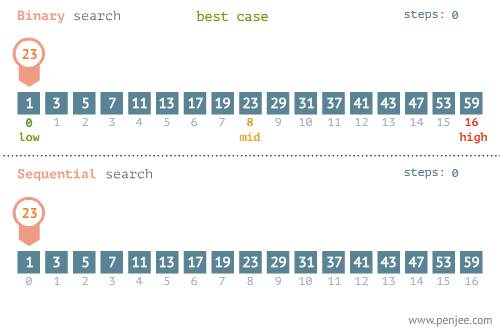

<table align='center'>
  <tr>
    <td><a href="" target="_blank"></td>
  <td></td>
  </tr>
  </table>
  </br>


<p align="center">
    
</p>

<h1 align='center'>Python - Platzi. 👨‍💻</h1>

<div align="center">
  <h1>Curso de POO y Algoritmos con Python</h1>
</div>

<div align="center"> 
  
</div>

# Introducción al documento

El contenido de este documento esta basado en el curso del mismo nombre dictado por [David Aroesti](https://github.com/jdaroesti) en [Platzi](https://platzi.com/r/karlbehrens/).

# Tabla de contenido
- [Programación Orientada a Objetos](#Programación-Orientada-a-Objetos)
    - [Objetivos](#Objetivos)
    - [Programación orientada a objetos en Python](#Programación-orientada-a-objetos-en-Python)
    - [Tipos de datos abstractos y clases, Instancias](#Tipos-de-datos-abstractos-y-clases,-Instancias)
    - [Decomposición](#Decomposición)
    - [Abstracción](#Abstracción)
    - [Encapsulación, getters and setters](#Encapsulación,-getters-and-setters)
    - [Herencia](#Herencia)
    - [Polimorfismo](#Polimorfismo)
- [Complejidad algorítmica](#Complejidad-algorítmica)
    - [Introducción a la complejidad algorítmica](#Introducción-a-la-complejidad-algorítmica)
    - [Medición temporal](#Medición-temporal)
    - [Conteo abstracto de operación](#Conteo-abstracto-de-operación)
    - [Notación asintótica](#Notación-asintótica)
    - [Clases de complejidad algorítmica](#Clases-de-complejidad-algorítmica)
- [Algoritmos de búsqueda y ordenación](#Algoritmos-de-búsqueda-y-ordenación)
    - [Búsqueda lineal](#Búsqueda-lineal)
    - [Búsqueda binaria](#Búsqueda-binaria)
    - [Ordenamiento de burbuja](#Ordenamiento-de-burbuja)
    - [Ordenamiento por inserción](#Ordenamiento-por-inserción)
    - [Ordenamiento por mezcla](#Ordenamiento-por-mezcla)
- [Ambientes virtuales](#Ambientes-virtuales)
- [Graficado](#Graficado)
    - [¿Por qué graficar?](#¿Por-qué-graficar?)
    - [Graficado simple](#Graficado-simple)
- [Algoritmos de optimización](#Algoritmos-de-optimización)
    - [Introducción a la optimización](#Introducción-a-la-optimización)
    - [El problema del morral](#El-problema-del-morral)

# Programación Orientada a Objetos

## Objetivos

Con este documento tenemos como **objetivos:**

- Entender cómo funciona la Programación Orientada a Objetos con Python.
- Entender cómo medir la eficiencia temporal y espacial de nuestros algoritmos.
- Entender cómo y por qué graficar.
- Aprender a resolver problemas de búsqueda, ordenación y optimización.

## Programación orientada a objetos en Python

Uno de los elementos más importantes de los lenguajes de programación es la utilización de clases para organizar programas en módulos y abstracciones de datos.

Las clases se pueden utilizar de muchas diversas maneras. Pero en este artículo hablaremos de cómo utilizarlas en el contexto de la programación orientada a objetos. La clave para entender la programación orientada a objetos es pensar en objetos como agrupaciones de datos y los métodos que operan en dichos datos.

Por ejemplo, podemos representar a una persona con propiedades como nombre, edad, género, etc. y los comportamientos de dicha persona como caminar, cantar, comer, etc. De la misma manera podemos representar unos audífonos con propiedades como su marca, tamaño, color, etc. y sus comportamientos como reproducir música, pausar y avanzar a la siguiente canción.

Puesto de otra manera, la programación orientada a objetos nos permite modelar cosas reales y concretas del mundo y sus relaciones con otros objetos.

Las ideas detrás de la programación orientada a objetos tienen más de 50 años y han sido ampliamente aceptadas y practicadas en los últimos treinta. A mediados de la década de los setenta se comenzaron a escribir artículos académicos explicando los beneficios de esta aproximación a la programación. También durante esos años se comenzaron a escribir los primeros lenguajes de programación que incorporaban estas ideas (como Smalltalk y CLU). Pero no fue hasta la llegada de Java y C++ que la idea consiguió un número importante de seguidores.

Hasta ahora, en el curso previo de esta serie hemos utilizado programación orientada a objetos de manera implícita. Cuando decimos "Los objetos son las principales cosas que un programa de Python manipula. Cada objeto tiene un tipo que define qué cosas puede realizar un programa con dicho objeto.", nos estamos refiriendo a las ideas principales de la programación orientada a objetos. Hemos utilizado los tipos lista y diccionario, entre muchos otros, así como los métodos asociados a dichos tipos. Así como los creadores de un lenguaje de programación sólo pueden diseñar una fracción muy pequeña de todas las funciones útiles (como abs, float, type, etc.), también pueden escribir una fracción muy pequeña de los tipos útiles (int, str, dict, list, etc.). Ya sabemos los mecanismos que nos permiten crear funciones, ahora veremos los mecanismos que nos permiten crear nuevos tipos (o clases).

### Clases en Python

Las estructuras primitivas con las que hemos trabajado hasta ahora nos permiten definir cosas sencillas, como el costo de algo, el nombre de un usuario, las veces que debe correr un bucle, etc. Sin embargo, existen ocasiones cuando necesitamos definir estructuras más complejas, por ejemplo un hotel. Podríamos utilizar dos listas: una para definir los cuartos y una segunda para definir si el cuarto se encuentra ocupado o no.

```py
cuartos_de_hotel = [101, 102, 103, 201, 202, 203]
cuarto_ocupado = [True, False, False, True, True, False]
```

Sin embargo, este tipo de organización rápidamente se sale de control. ¿Qué tal que quisieramos añadir más propiedades, cómo si el cuarto ya fue aseado o no? ¿Si el cuarto tiene cama doble o sencilla? Esto nos lleva a una falta fuerte de organización y es justamente el punto que justifica la existencia de clases.

Las clases nos permiten crear nuevos tipos que contiene información arbitraria sobre un objeto. En el caso del hotel, podríamos crear dos clases `Hotel()` y `Cuarto()` que nos permitiera dar seguimiento a las propiedades como número de cuartos, ocupación, aseo, tipo de habitación, etc.

Es importante resaltar que las clases sólo proveen estructura. Son un molde con el cual podemos construir objetos específicos. La clase señala las propiedades que los hoteles que modelemos tendrán, pero no es ningún hotel específico. Para eso necesitamos las instancias.

### Instancias

Mientras que las clases proveen la estructura, las instancias son los objetos reales que creamos en nuestro programa: un hotel llamado PlatziHotel o Hilton. Otra forma de pensarlo es que las clases son como un formulario y una vez que se llena cada copia del formulario tenemos las instancias que pertenecen a dicha clase. Cada copia puede tener datos distintos, al igual que cada instancia es distinta de las demás (aunque todas pertenecen a una misma clase).

Para definir una clase, simplemente utilizamos el _keyword_ `class`. Por ejemplo:

```py
class Hotel:
    pass
```

Una vez que tenemos una clase llamada Hotel podemos generar una instancia llamando al constructor de la clase.

```py
hotel = Hotel()
```

### Atributos de la instancia

Todas las clases crean objetos y todos los objetos tienen atributos. Utilizamos el método especial `__init__` para definir el estado inicial de nuestra instancia. Recibe como primer parámetro obligatorio `self` (que es simplemente una referencia a la instancia).

```py
class Hotel:
    
    def __init__(self, numero_maximo_de_huespedes, lugares_de_estacionamiento):
        self.numero_maximo_de_huespedes = numero_maximo_de_huespedes
        self.lugares_de_estacionamiento = lugares_de_estacionamiento
        self.huespedes = 0


hotel = Hotel(numero_maximo_de_huespedes=50, lugares_de_estacionamiento=20)
print(hotel.lugares_de_estacionamiento) # 20
```

### Métodos de instancia

Mientras que los atributos de la instancia describen lo que representa el objeto, los métodos de instancia nos indican qué podemos hacer con las instancias de dicha clase y normalmente operan en los mencionados atributos. Los métodos son equivalentes a funciones dentro de la definición de la clase, pero todos reciben `self` como primer argumento.

```py
class Hotel:

    ...

    def anadir_huespedes(self, cantidad_de_huespedes):
        self.huespedes += cantidad_de_huespedes

    def checkout(self, cantidad_de_huespedes):
        self.huespedes -= cantidad_de_huespedes

    def ocupacion_total(self):
        return self.huespedes


hotel = Hotel(50, 20)
hotel.anadir_huespedes(3)
hotel.checkout(1)
hotel.ocupacion_total() # 2
```

Ahora que ya sabemos qué son las clases y cómo las podemos utilizar en nuestros programas, platícanos qué clases te serían útiles para modelar en uno de tus programas.

## Tipos de datos abstractos y clases, Instancias

### Abstractos

En Python todo es un objeto y tiene un tipo, esto significa que todo lo que hacemos en nuestro programa tiene una representación en memoria, los datos y el comportamiento se puede encapsular en un objeto.

Los tipos nos permiten modelar y manipular el mundo a través de la programación.

Las formas de interactuar con un objeto:

- Creación
- Manipulación
- Destrucción

Cuando trabajamos con programación orientada a objetos tenemos varias ventajas: 

- **De composición:** podemos estructurarlos en objetos mas pequeños.
- **Abstracción:** no nos preocupamos el funcionamiento del proceso de su comportamiento.
- **Encapsulación:** podemos esconder ciertos datos que solo son relevantes internamente en el objeto.

```py
# definición de clase

# Primero definimos el nombre de la clase y podemos determinar si hereda de otra clase.
class nombre_de_la_clase(super_clase):

    # El método init es un constructor, y siempre los métodos dentro
    # de los parámetros inician con el parámetro self
    def __init__(self, params):
        expresion

    # Las clases pueden tener comportamientos,
    # y estos los definimos con los métodos.
    def nombre_del_metodo(self, params):
        expresion
```

Para ver un ejemplo más a detalle crearemos una clase _Persona_

```py
# Definición
class Persona:

    def __init__(self, nombre, edad):
        self.nombre = nombre
        self.edad = edad

    def saluda(self, otra_persona):
        return f'Hola {otra_persona.nombre}, me llamo {self.nombre}.'


# Uso
david = Persona('David', 28)
karl = Persona('Karl', 26)

david.saluda(karl)
'Hola Karl, me llamo David'
```

### Instancias

Mientras que la clase es un molde, a los objetos creados se les conoce como instancias. Cuando se crea una instancia, se ejecuta el método `__init__`, y todos los métodos de una clase reciben implícitamente como primer parámetro `self`.

Los atributos de clase nos permiten:
- Representar datos.
- Procedimientos para interactuar con los mismos (métodos).
- Mecanismos para esconder la representación.

Para acceder a los atributos de estos objetos se hace a través de la notación de punto. Además puede tener atributos privados (Por convención comienzan con _ ).

```py
class Coordenada:
    
    def __init__(self, x, y):
        self.x = x
        self.y = y

    def distancia(self, otra_coordenada):
        x_diff = (self.x - otra_coordenada.x)**2
        y_diff = (self.y - otra_coordenada.y)**2

        return (x_diff + y_diff)**0.5


if __name__ == '__main__'
    coord_1 = Coordenada(3, 30)
    coord_2 = Coordenada(4, 8)

    print(coord_1.distancia(coord_2))

    # Para ver si una variable es una instancia de una clase
    # podemos verificar con isinstance
    print(isinstance(coord_2, Coordenada))
```

## Decomposición

La **decomposición** es un concepto simple pero poderoso que implica:
- Dividir un problema en problemas más pequeños.
- Las clases permiten crear mayores abstracciones en forma de componentes.
- Cada clase se encarga de una parte del problema y el programa se vuelve más fácil de mantener.

Para realizar un ejemplo de decomposición modelaremos un automóvil.

```py
# Creamos la clase Automóvil.
class Automovil:

    # El constructor creara todas las características de la instancia.
    def __init__(self, modelo, marca, color):
        self.modelo = modelo
        self.marca = marca
        self.color = color
        self._estado = 'en_reposo'
        self._motor = Motor(cilindros=4) # Hacemos referencia a la clase Motor.


    # La clase automóvil tiene el método de acelerar.
    def acelerar(self, tipo='despacio'):
        if tipo == 'rapida':
            # De la clase Motor ejecuta el método inyecta_gasolina.
            self._motor.inyecta_gasolina(10)
        else:
            self._motor.inyecta_gasolina(3)

        self._estado = 'en_movimiento'


    def frenar(self):
        self._motor.inyecta_gasolina(0)
        self._estado = 'en_reposo'


# Creamos la clase Motor
class Motor:

    # Con el constructor definimos sus características.
    def __init__(self, cilindros, tipo='gasolina'):
        self.cilindros = cilindros
        self.tipo = tipo
        self._temperatura = 0


    # La clase motor tiene el método de inyecta_gasolina.
    def inyecta_gasolina(self, cantidad):
        pass
```

## Abstracción

La **abstracción** es:
- Enfocarnos en la información relevante.
- Separar la información central de los detalles secundarios.
- Podemos utilizar variables y métodos (privados o públicos).

```py
# Creamos la clase Lavadora
class Lavadora:

    def __init__(self):
        pass

    # Tiene un método publico lavar que referencia a otros métodos
    def lavar(self, temperatura='caliente'):
        self._llenar_tanque_de_agua(temperatura)
        self._anadir_jabon()
        self._lavar()
        self._centrifugar()


    # Los métodos privados de la clase no son relevantes
    # para el uso desde afuera de la clase y por
    # convención se inicia con _

    def _llenar_tanque_de_agua(self, temperatura):
        print(f'Llenando el tanque con agua {temperatura}')


    def _anadir_jabon(self):
        print('Añadiendo jabón')


    def _lavar(self):
        print('Lavando la ropa')


    def _centrifugar(self):
        print('Centrifugando la ropa')


if __name__ == '__main__':
    lavadora = Lavadora()
    lavadora.lavar() # Ejecutamos el método publico de nuestra instancia.
```

## Encapsulación, getters and setters

La **encapsulación** nos permite agrupar datos y su comportamiento, controla el acceso a dichos datos y previene modificaciones no autorizadas.

En el siguiente ejemplo podrás ver que los datos son privados, pero podemos acceder y modificarlos a través de métodos.

```py
class CasillaDeVotacion:


    def __init__(self, identificador, pais):
        self._indentificador = identificador
        self._pais = pais
        self._region = None


    # Para que nuestra función funcione con dot notation
    # utilizamos el decorador @property
    @property
    def region(self):
        return self._region


    # Para crear un setter que funcione con dot notation
    # primero hacemos referencia al nombre de la propiedad seguido
    # de .setter (@region.setter)
    @region.setter
    def region(self, region):
        if region in self._pais:
            self._region = region
        else:
            raise ValueError(f'La región {region} no es válida en {self._pais}')


casilla = CasillaDeVotacion(123, ['Ciudad de México', 'Morelos'])
print(casilla.region)
casilla.region = 'Ciudad de México'
print(casilla.region)
```

En consola ejecutamos nuestro script y veremos los resultados.

```bash
python3 casilla.py  # Ejecutamos nuestro código.

# Y estos serán nuestros resultados.
None
Ciudad de México
```

## Herencia

La **herencia** permite modelar una jerarquía de clases, con el cual compartiremos comportamientos en común. Al padre se le conoce como _superclase_ y al hijo como _subclase_.

```py
# Creamos la clase Rectangulo
class Rectangulo:

    def __init__(self, base, altura):
        self.base = base
        self.altura = altura

    def area(self):
        return self.base * self.altura


# La clase Cuadrado extiende de Rectangulo, esto significa
# que todas las propiedades y métodos de Rectangulo
# las heredara Cuadrado.
class Cuadrado(Rectangulo):

    # Inicia una instacia de Cuadrado, pero las propiedades
    # de Rectangulo las inicializa con super().__init__(params)
    def __init__(self, lado):
        super().__init__(lado, lado)


if __name__ == '__main__':
    rectangulo = Rectangulo(base=3, altura=4)
    print(rectangulo.area())

    cuadrado = Cuadrado(lado=5)
    print(cuadrado.area())
```

## Polimorfismo

El **polimorfismo** es la habilidad de tomar varias formas, en este caso la habilidad de cambiar el comportamiento de un método. En Python, nos permite cambiar el comportamiento de una _superclase_ para adaptarlo a la subclase solo nombrando el método y escribiendo su comportamiento.

```py
class Persona:

    def __init__(self, nombre):
        self.nombre = nombre

    # Definimos el método avanzar.
    def avanza(self):
        print('Ando caminando')


# Ciclista extiende de Persona
class Ciclista(Persona):

    def __init__(self, nombre):
        super().__init__(nombre)


    # Para aplicar polimorfismo en el método de la superclase
    # simplemente definimos su comportamiento y nombrando el método.
    def avanza(self):
        print('Ando moviendome en mi bicicleta')


def main():
    persona = Persona('David')
    persona.avanza()

    ciclista = Ciclista('Daniel')
    ciclista.avanza()


if __name__ == '__main__':
    main()
```

# Complejidad algorítmica

## Introducción a la complejidad algorítmica

La **complejidad algorítmica** nos permite comparar la eficiencia de 2 algoritmos, esto a su vez va a predecir el **tiempo** que va a tomar resolver un problema. No solamente podemos analizar la complejidad desde la perspectiva **temporal**, también la podemos hacer desde la **espacial**, como por ejemplo cuanto espacio en memoria necesitamos.

La complejidad algorítmica temporal la podemos definir como **T(n)** el cual determinara el tiempo que demora en resolver nuestro algoritmo.

### Aproximaciones

¿Como podríamos aplicar nuestra función **T(n)**?

- Cronometrar el tiempo en el que corre un algoritmo. Sin embargo **no es una buena forma de medir** los algoritmos, ya que no se puede predecir cuanto demorara a medida que crece nuestros pasos.

- Contar los pasos con una medida abstracta de operación. Nos puede acercar a una medición ideal, sin embargo varia mucho de algoritmo en algoritmo y a medida que crece nuestro dataset existen muchos términos que llegan a ser irrelevantes.

- Contar los pasos conforme nos aproximamos al infinito pero con una medida asintótica.

## Medición temporal

Para una realizar una medida temporal simplemente calculamos la diferencia del tiempo previo y posterior de la ejecución del algoritmo.

```py
import time

def factorial(n):
    respuesta = 1

    while n > 1:
        respuesta *= n
        n -= 1

    return respuesta


def factorial_r(n):
    if n == 1:
        return 1

    return n * factorial(n - 1)


if __name__ == '__main__':
    n = 200000

    comienzo = time.time()
    factorial(n)
    final = time.time()
    print(final - comienzo)

    comienzo = time.time()
    factorial_r(n)
    final = time.time()
    print(final - comienzo)
```

## Conteo abstracto de operación

Con esta técnica contamos los pasos que realiza nuestro algoritmo. En el siguiente ejemplo `respuesta` tendrá los números de pasos que realiza nuestro código al ejecutar.

```py
def f(x):

    respuesta = 0

    for i in range(1000):
        respuesta += 1

    for i in range(x):
        respuesta += x

    for i in range(x):
        for j in range(x):
            respuesta += 1
            respuesta += 1

    return respuesta
```

## Notación asintótica

Cuando hablamos de **notación asintótica** no importan las variaciones pequeñas, el enfoque se centra en lo que pasa conforme el tamaño del problema se acerca al infinito.

Siempre tenemos que estar preparados para cualquier caso, por lo que tenemos que saber medir a nuestro algoritmo en el mejor, promedio y peor de los casos.

Lo mejor que nos permite comparar nuestros algoritmos y su capacidad es medir el peor de los casos, ahí es donde entra el **Big O notation**, donde lo único que importa es el termino de mayor tamaño, sin importar las constantes que las acompañan. 

```py
# Ley de la suma

def f(n):
    for i in range(n):
        print(i)

    for i in range(n):
        print(i)

# En este caso el mayor término es n
# O(n) + O(n) = O(n + n) = O(2n) = O(n)
```

```py
# Ley de la suma

def f(n):
    for i in range(n):
        print(i)

    for i in range(n * n):
        print(i)

# En este caso el mayor término es n²
# O(n) + O(n * n) = O(n + n²) = O(n²)
```

```py
# Ley de la multiplicación

def f(n):

    for i in range(n):

        for i in range(n):
            print(i, j)

# En este caso el mayor término es n²
# O(n) + O(n * n) = O(n * n) = O(n²)
```

```py
# Recursividad múltiple

def fibonacci(n):

    if n == 0 or n == 1:
        return 1

    return fibonacci(n - 1) +  fibonacci(n - 2)

# En este caso el mayor término es 2**n (el símbolo ** denota "elevado a"),
# ya que realiza recursividad 2 veces por n veces.
# O(2**n)
```

## Clases de complejidad algorítmica

Existen distintos tipos de complejidad algorítmica:

- **O(1) Constante:** no importa la cantidad de input que reciba, siempre demorara el **mismo tiempo**.
- **O(n) Lineal:** la complejidad crecerá de forma **proporcional** a medida que crezca el input.
- **O(log n) Logarítmica:** nuestra función crecerá de forma **logarítmica** con respecto al input. Esto significa que en un inicio crecerá rápido, pero luego se estabilizara.
- **O(n log n) Log lineal:** crecerá de forma **logarítmica** pero junto con una **constante**.
- **O(n²) Polinomial:** crecen de forma cuadrática. No son recomendables a menos que el input de datos en pequeño.
- **O(2^n) Exponencial:** crecerá de forma **exponencial**, por lo que la carga es muy alta. Para nada recomendable en ningún caso, solo para análisis conceptual.
- **O(n!) Factorial:** crece de forma **factorial**, por lo que al igual que el exponencial su carga es muy alta, por lo que jamas utilizar algoritmos de este tipo.

<div align="center"> 
  
</div>

# Algoritmos de búsqueda y ordenación

## Búsqueda lineal

La **búsqueda lineal** es un algoritmo muy sencillo. Consta en buscar si un elemento se encuentra dentro de una lista, array o un sistema ordenado o no ordenado para poder determinar si el elemento se encuentra en el o forma parte de el.

¿Cuál es el peor caso del siguiente código? Si nos fijamos existe un **for loop** que crece según el tamaño de la lista, por lo cual nuestro Big O es O(n).

```py
import random

def busqueda_lineal(lista, objetivo):
    match = False

    for elemento in lista: # O(n)
        if elemento == objetivo:
            match = True
            break

    return match


if __name__ == '__main__':
    tamano_de_lista = int(input('De que tamano sera la lista? '))
    objetivo = int(input('Que numero quieres encontrar? '))

    lista = [random.randint(0, 100) for i in range(tamano_de_lista)]

    encontrado = busqueda_lineal(lista, objetivo)
    print(lista)
    print(f'El elemento {objetivo} {"esta" if encontrado else "no esta"} en la lista')
```

## Búsqueda binaria

La **búsqueda binaria** toma una estrategia llamada "Divide y conquista", la cual consiste en dividir el problema en 2 en cada iteración. Este algoritmo asume que la lista se encuentra ordenada, por lo que es necesario realizar este paso primero.

La **búsqueda binaria** es uno de los mejores algoritmos que se tienen hoy en día para búsqueda, ya que reduce significativamente el numero de pasos, y así disminuyendo nuestro Big O.

<div align="center">
  <h4>Caso Promedio</h4>
</div>

<div align="center"> 
  
</div>

<div align="center">
  <h4>Peor de los Casos</h4>
</div>

<div align="center"> 
  
</div>

<div align="center">
  <h4>Mejor de los Casos</h4>
</div>

<div align="center"> 
  
</div>

Para ver de forma practica haremos una búsqueda binaria a través de código. Lo primero que tenemos que realizar es ordenar nuestra lista antes de ejecutar la búsqueda.

```py
import random

def busqueda_binaria(lista, comienzo, final, objetivo):
    print(f'buscando {objetivo} entre {lista[comienzo]} y {lista[final - 1]}')
    if comienzo > final:
        return False

    medio = (comienzo + final) // 2

    if lista[medio] == objetivo:
        return True
    elif lista[medio] < objetivo:
        return busqueda_binaria(lista, medio + 1, final, objetivo)
    else:
        return busqueda_binaria(lista, comienzo, medio - 1, objetivo)


if __name__ == '__main__':
    tamano_de_lista = int(input('De que tamano es la lista? '))
    objetivo = int(input('Que numero quieres encontrar? '))

    lista = sorted([random.randint(0, 100) for i in range(tamano_de_lista)])

    encontrado = busqueda_binaria(lista, 0, len(lista), objetivo)

    print(lista)
    print(f'El elemento {objetivo} {"esta" if encontrado else "no esta"} en la lista')
```

## Ordenamiento de burbuja

El primer algoritmo de ordenamiento que veremos es el **ordenamiento de burbuja**. Es un algoritmo que recorre repetidamente una lista que necesita ordenarse. Compara elementos adyacentes y los intercambia si están en el orden incorrecto. Este procedimiento se repite hasta que no se requiere mas intercambios, lo que indica que la lista se encuentra ordenada.

<div align="center"> 
  
</div>

```py
import random


def ordenamiento_de_burbuja(lista):
    n = len(lista)

    for i in range(n):
        for j in range(0, n - i - 1): # O(n) * O(n) = O(n * n) = O(n**2)

            if lista[j] > lista[j + 1]:
                lista[j], lista[j + 1] = lista[j + 1], lista[j]

    return lista

if __name__ == '__main__':
    tamano_de_lista = int(input('De que tamano sera la lista? '))

    lista = [random.randint(0, 100) for i in range(tamano_de_lista)]
    print(lista)

    lista_ordenada = ordenamiento_de_burbuja(lista)
    print(lista_ordenada)
```

## Ordenamiento por inserción

El ordenamiento por inserción es uno de los algoritmos más comunes que estudian los Científicos del Cómputo. Es intuitivo y fácil de implementar, pero es muy ineficiente para listas de gran tamaño.

Una de las características del ordenamiento por inserción es que ordena en “su lugar.” Es decir, no requiere memoria adicional para realizar el ordenamiento ya que simplemente modifican los valores en memoria.

La definición es simple:

    Una lista es dividida entre una sublista ordenada y otra sublista desordenada. Al principio, la sublista ordenada contiene un solo elemento, por lo que por definición se encuentra ordenada.

    A continuación se evalua el primer elemento dentro la sublista desordenada para que podamos insertarlo en el lugar correcto dentro de la lista ordenada.

    La inserción se realiza al mover todos los elementos mayores al elemento que se está evauluando un lugar a la derecha.

    Continua el proceso hasta que la sublista desordenada quede vacia y, por lo tanto, la lista se encontrará ordenada.

Veamos un ejemplo:

Imagina que tienes la siguiente lista de números:

7, 3, 2, 9, 8

Primero añadimos 7 a la sublista ordenada:

**7**, 3, 2, 9, 8

Ahora vemos el primer elemento de la sublista desordenada y lo guardamos en una variable para mantener el valor. A esa variable la llamaremos `valor_actual`. Verificamos que 3 es menor que 7, por lo que movemos 7 un lugar a la derecha.

**7**, 7, 2, 9, 8 (valor_actual=3)

3 es menor que 7, por lo que insertamos el valor en la primera posición.

**3, 7**, 2, 9, 8

Ahora vemos el número 2. 2 es menor que 7 por lo que lo movemos un espacio a la derecha y hacemos lo mismo con 3.

**3, 3, 7**, 9, 8 (valor_actual=2)

Ahora insertamos 2 en la primera posición.

**2, 3, 7**, 9, 8

9 es más grande que el valor más grande de nuestra sublista ordenada por lo que lo insertamos directamente en su posición.

**2, 3, 7, 9**, 8

El último valor es 8. 9 es más grande que 8 por lo que lo movemos a la derecha:

**2, 3, 7, 9**, 9 (valor_actual=8)

8 es más grande que 7, por lo que procedemos a insertar nuestro valor_actual.

**2, 3, 7, 8, 9**

Ahora la lista se encuentra ordenada y no quedan más elementos en la sublista desordenada.

Antes de ver la implementación en Python, trata de implementarlo por ti mismo y compártenos tu algoritmo en la sección de comentarios.

Esta es una forma de implementar el algoritmo anterior:

```py
def ordenamiento_por_insercion(lista):

    for indice in range(1, len(lista)):
        valor_actual = lista[indice]
        posicion_actual = indice

        while posicion_actual > 0 and lista[posicion_actual - 1] > valor_actual:
            lista[posicion_actual] = lista[posicion_actual - 1]
            posicion_actual -= 1

        lista[posicion_actual] = valor_actual
```

## Ordenamiento por mezcla

El **ordenamiento por mezcla** creado por **John von Neumann** el cual aplica el concepto de "divide y conquista". Primero divide una lista en partes iguales hasta que quedan sublistas de 1 o 0 elementos. Luego las recombina en forma ordenada.

<div align="center"> 
  
</div>

```py
import random

def ordenamiento_por_mezcla(lista):
    if len(lista) > 1:
        medio = len(lista) // 2
        izquierda = lista[:medio]
        derecha = lista[medio:]
        print(izquierda, '*' * 5, derecha)

        # llamada recursiva en cada mitad
        ordenamiento_por_mezcla(izquierda)
        ordenamiento_por_mezcla(derecha)

        # Iteradores para recorrer las dos sublistas
        i = 0
        j = 0
        # Iterador para la lista principal
        k = 0

        while i < len(izquierda) and j < len(derecha):
            if izquierda[i] < derecha[j]:
                lista[k] = izquierda[i]
                i += 1
            else:
                lista[k] = derecha[j]
                j += 1

            k += 1

        while i < len(izquierda):
            lista[k] = izquierda[i]
            i += 1
            k +=1

        while j < len(derecha):
            lista[k] = derecha[j]
            j += 1
            k += 1
        
        print(f'izquierda {izquierda}, derecha {derecha}')
        print(lista)
        print('-' * 50)

    return lista


if __name__ == '__main__':
    tamano_de_lista = int(input('De que tamano sera la lista? '))

    lista = [random.randint(0, 100) for i in range(tamano_de_lista)]
    print(lista)
    print('-' * 20)

    lista_ordenada = ordenamiento_por_mezcla(lista)
    print(lista_ordenada)
```

# Ambientes virtuales

Los **ambientes virtuales** permiten aislar el ambiente para poder instalar diversas versiones de paquetes. A partir de _python 3_ se incluye en la librería estándar en el módulo **venv**. Ningún ingeniero profesional de Python trabaja sin ellos.

**Pip** permite descargar paquetes de terceros para utilizar en nuestro programa, también permite compartir nuestros paquetes con terceros y también podemos definir la versión del paquete que necesitamos.

Para crear un ambiente virtual primer crearemos el directorio para nuestro proyecto.


```bash
mkdir graficado             # Creamos el directorio del proyecto.
cd graficado/               # Ingresamos al directorio.
python3 -m venv env         # Creamos un ambiente virtual en env.
source env/bin/activate     # Activamos el ambiente.
```

Para poder instalar librerías lo haremos con el comando pip.

```bash
pip install bokeh   # pip install instalara la librería.
pip freeze          # Con pip freeze veremos que librerías están instaladas.
```

Para desactivar el ambiente virtual lo haremos con el siguiente comando.

```bash
deactivate          # Comando para desactivar ambiente Virtual
```

# Graficado

## ¿Por qué graficar?

Es importante que podamos traducir los datos que nos arrojan nuestro programa en un elemento visual, así podemos realizar reconocimientos de patrones, predicción de series, simplifica la interpretación y la conclusión acerca de los datos.

<div align="center"> 
  
</div>

## Graficado simple

La librería [**Bokeh**](http://docs.bokeh.org/en/latest/index.html) permite construir gráficas complejas de manera rápida y con comandos simples, también nos permite exportar a varios formatos como html, notebooks, imágenes, etc. [**Bokeh**](http://docs.bokeh.org/en/latest/index.html#) se puede utilizar en el servidor con **Flask** y **Django**.

```py
from bokeh.plotting import figure, output_file, show

if __name__ == '__main__':
    output_file('graficado_simple.html')
    fig = figure()
    
    total_vals = int(input('Cuantos valores quieres graficar?'))
    x_vals = list(range(total_vals))
    y_vals = []

    for x in x_vals:
        val = int(input(f'Valor y para {x}'))
        y_vals.append(val)

    fig.line(x_vals, y_vals, line_width=2)
    show(fig)
```

# Algoritmos de optimización

## Introducción a la optimización

El concepto de **optimización** permite resolver muchos problemas de manera computacional. Cuando pensamos en un algoritmo de optimización debemos definir una función objetivo que debemos maximizar o minimizar, respetando una serie de limitantes que definamos. 

## El problema del morral

<div align="center"> 
  
</div>

Imagina que eres un ladrón que entra a un museo pero tienes un gran problema, nada mas tienes una mochila pero hay muchísimas cosas mas de las que puedes cargar, por lo cual debes determinar cuales artículos puedes cargar y te entregaran el mayor valor posible.

Para este problema sabemos que no podemos dividir los artículos, por lo que nuestra primera aproximación sera evaluar los artículos.

```py
def morral(tamano_morral, pesos, valores, n):

    if n == 0 or tamano_morral == 0:
        return 0

    if pesos[n - 1] > tamano_morral:
        return morral(tamano_morral, pesos, valores, n - 1)

    return max(valores[n - 1] + morral(tamano_morral - pesos[n - 1], pesos, valores, n - 1),
                morral(tamano_morral, pesos, valores, n - 1))


if __name__ == '__main__':
    valores = [60, 100, 120]
    pesos = [10, 20, 30]
    tamano_morral = 40
    n = len(valores)

    resultado = morral(tamano_morral, pesos, valores, n)
    print(resultado)
```

---

<br><br><br>
<table align='center'>
    <tr align='center'>
        <h2 align='center'>Technologies used. 📌</h2>
        <td>
            <a href="https://www.python.org/downloads/"></a>
        </td>
        <td><center>Python</center></td>
    </tr>
    <tr align='center'>
        <td>
            <a href="https://code.visualstudio.com/"></a>
        </td>
        <td><center>VSCode</center></td>
    </tr>
</table>
<br><br><br>

---

<br><br><br>
<table>
    <theader>
        <tr>
            <th colspan=2>
                <center><strong>LICENSE</strong></center>
            </th>
        </tr>
        <tr>
            <th colspan=2>
                <center>Git Repository Cloner 2022</center>
            </th>
        </tr>
        <tr>
            <th>
                <center>License</center>
            </th>
            <th>
                <center>Author</center>
            </th>
        </tr>
    </theader>
    <tbody>
        <tr>
            <td>
                <center>[GNU General Public License V3]</center>
            </td>
            <td>
                <center>[Facundo Falcone - CaidevOficial]</center>
            </td>
        </tr>
        <tr>
            <td colspan=2>
                <center>
                    This program is free software: you can redistribute it and/or modify
                    it under the terms of the GNU General Public License as published by
                    the Free Software Foundation, either version 3 of the License, or
                    (at your option) any later version.
                    This program is distributed in the hope that it will be useful,
                    but WITHOUT ANY WARRANTY; without even the implied warranty of
                    MERCHANTABILITY or FITNESS FOR A PARTICULAR PURPOSE.See the
                    GNU General Public License for more details.
                    You should have received a copy of the GNU General Public License
                    along with this program.
                    If not, see <a href='https://www.gnu.org/licenses/'>GNU Licenses</a>.
                </center>
            </td>
        </tr>
    </tbody>
</table>
<br><br><br>

---

<br><br><br>
<table align='center'>
  <theader>
  <th><h2 align='center'>Where to find me: 🌎</h2></th>
    <tr align='center'>
      <td>
        
      </td>
    </tr>
    <th><center>🤴 Facu Falcone - Python & GCP Developer</center></th>
    </theader>
    <tbody>
    <tr align='center'>
      <td>
        <a href="https://github.com/caidevOficial/">
          
        </a>
      </td>
    </tr>
    <tr align='center'>
      <td>
          <a href="https://www.linkedin.com/in/facundo-falcone/">
            
          </a>
      </td>
    </tr>
    <tr align='center'>
      <td>
        <a href="https://cafecito.app/caidevoficial/">
          
        </a>
      </td>
    </tr>
    <tr align='center'>
      <td>
        <a href='https://ko-fi.com/P5P74JBOH' target='_blank'>
          
        </a>
      </td>
    </tr>
  </tbody>
</table>
